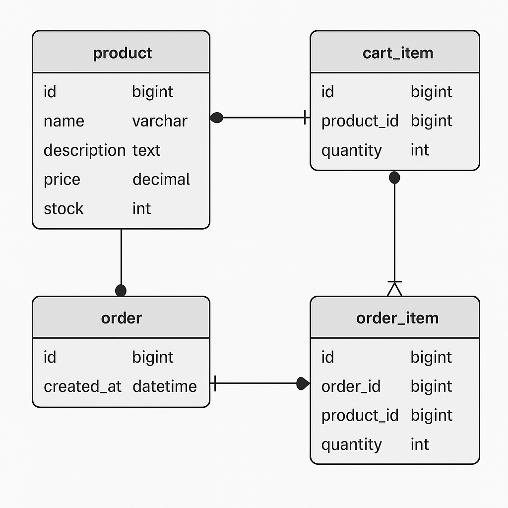

# Knowledge Base Test – Pretest Backend Magang

## 1. Apa itu REST API?

REST API (Representational State Transfer Application Programming Interface) adalah antarmuka yang memungkinkan komunikasi antar sistem melalui protokol HTTP.
REST API menggunakan metode HTTP standar seperti GET, POST, PUT, dan DELETE untuk mengakses dan memanipulasi data. Data biasanya dikirim dalam format JSON atau XML.

## 2. Jelaskan perbedaan antara server-side processing dan client-side processing.
- **Server-side processing**: logika dan proses data terjadi di server. Client hanya menerima hasil akhir (misalnya HTML yang sudah jadi).
- **Client-side processing**: pemrosesan dilakukan di sisi pengguna, biasanya menggunakan JavaScript untuk manipulasi tampilan secara langsung tanpa perlu bolak-balik ke server.

## 3. Apa yang dimaksud dengan monolith dan microservices? Berikan contohnya.
- **Monolith**: seluruh fitur aplikasi disatukan dalam satu codebase besar. Contoh: aplikasi e-commerce yang punya modul login, produk, dan pembayaran dalam satu project.
- **Microservices**: sistem dibagi menjadi beberapa layanan kecil yang terpisah dan saling berkomunikasi via API. Contoh: satu service khusus mengatur produk, satu lagi untuk autentikasi, dan satu untuk pembayaran.

## 4. Apa yang dimaksud dengan Inversion of Control dan Dependency Injection?
- **Inversion of Control (IoC)**: prinsip di mana alur kontrol program diberikan pada framework, bukan ditulis langsung oleh developer.
- **Dependency Injection (DI)**: implementasi dari IoC di mana dependency (misalnya service class) diberikan ke suatu objek dari luar, bukan dibuat di dalam objek tersebut.

## 5. Apakah kamu familiar dengan Java dan Spring Boot?
Java adalah bahasa pemrograman OOP yang stabil, banyak digunakan di enterprise, Android, dan backend development.

Spring Boot adalah ekstensi dari Spring yang menyederhanakan konfigurasi dan setup aplikasi Spring:

Tidak perlu konfigurasi XML.

Sudah include embedded server (Tomcat).

Mendukung REST API, JPA, Security, dll.

Kemudian temen-temen buat design database, module (monolith/microservices) berdasarkan gambar atau schenario tersebut. Serta jelakan mengapa menggunakan design tersebut.

Desain sistem yang ditunjukkan pada gambar menggunakan pendekatan arsitektur monolith, di mana seluruh fitur utama seperti katalog produk, keranjang belanja, checkout, dan riwayat transaksi diintegrasikan dalam satu aplikasi backend. Semua fitur berbagi satu basis kode dan satu database, sehingga pengelolaan dan pengembangan menjadi lebih sederhana. Pendekatan ini dipilih karena sesuai untuk sistem berskala kecil hingga menengah seperti proyek pretest atau tugas magang. Dengan hanya satu project, proses build dan deployment menjadi lebih cepat serta efisien. Selain itu, tidak diperlukan konfigurasi komunikasi antar layanan seperti pada microservices. Hal ini sangat mendukung tim pengembang yang berukuran kecil dan mempercepat waktu penyelesaian proyek. Nantinya, jika sistem berkembang dan membutuhkan skalabilitas yang lebih tinggi, arsitektur ini tetap fleksibel untuk dipecah menjadi microservices sesuai kebutuhan.

